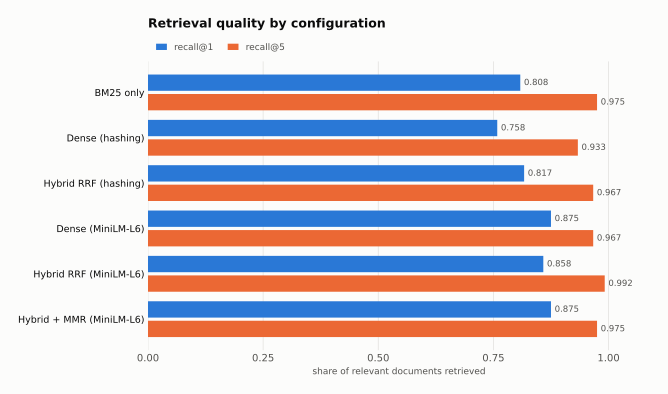
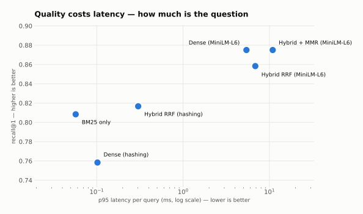
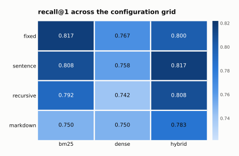
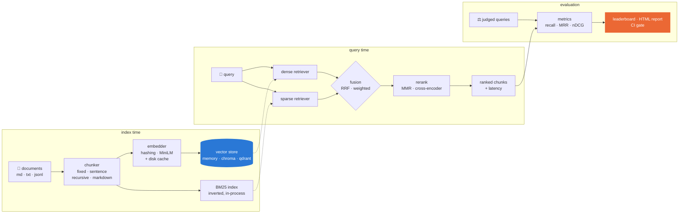

# ragforge

**Hybrid retrieval with a built-in evaluation harness — measure your RAG instead of guessing.**

[](https://github.com/laiba-mazhar/ragforge/actions/workflows/ci.yml)
[](https://www.python.org/downloads/)
[](LICENSE)

Most RAG projects ship a retriever and never find out whether it works. Chunk size gets
picked from a blog post, "hybrid search" gets switched on because it sounds better, and
the only quality signal is someone typing three questions into a demo and nodding.

ragforge is the other half. It gives you a real retrieval stack — dense, BM25, rank
fusion, re-ranking, three vector-store backends — and a harness that puts a **number**
on every choice you make, with a confidence interval and a per-query breakdown of what
got better and what quietly got worse.

```bash
pip install -e .
ragforge sweep --corpus examples/corpus --queries examples/evalset.jsonl --primary recall@1
```

```
Sweep leaderboard — ranked by recall@1
12 configurations · 60 queries

 #  configuration                      recall@1    mrr  ndcg@10  p95 ms  chunks
--  ---------------------------------  --------  -----  -------  ------  ------
 1  fixed / hashing / bm25                0.817  0.924    0.932     0.1      41
 2  sentence / hashing / hybrid[rrf]      0.817  0.931    0.935     0.2      62
 3  sentence / hashing / bm25             0.808  0.918    0.929     0.0      62
 ...
12  recursive / hashing / dense           0.742  0.874    0.888     0.1      63
```

---

## The result that makes the point

Same 20-document corpus, same 60 judged queries, same cut-offs — only the retrieval
stack changes. Every figure below is regenerated by
[`scripts/make_charts.py`](scripts/make_charts.py) from a real sweep, so the numbers
cannot drift away from the code.

<picture>
  <source media="(prefers-color-scheme: dark)" srcset="docs/recall-dark.svg">
  
</picture>

| Configuration | recall@1 | recall@3 | recall@5 | MRR | nDCG@10 | p95 latency |
|---|---:|---:|---:|---:|---:|---:|
| BM25 only | 0.808 | 0.925 | 0.975 | 0.918 | 0.929 | **0.1 ms** |
| Dense (built-in hashing embedder) | 0.758 | 0.892 | 0.933 | 0.883 | 0.895 | 0.1 ms |
| Hybrid, RRF (hashing) | 0.817 | 0.933 | 0.967 | 0.931 | 0.935 | 0.2 ms |
| Dense (MiniLM-L6) | **0.875** | 0.942 | 0.967 | **0.975** | 0.959 | 6.8 ms |
| Hybrid, RRF (MiniLM-L6) | 0.858 | **0.958** | **0.992** | 0.967 | **0.969** | 5.6 ms |
| Hybrid + MMR (MiniLM-L6) | **0.875** | 0.950 | 0.975 | 0.972 | 0.960 | 10.6 ms |

Three things fall out of that table, and none of them were obvious in advance:

- **BM25 is hard to beat.** A well-implemented lexical baseline scores 0.808 recall@1 in
  a tenth of a millisecond. Any dense stack that cannot clear it is costing you latency
  for nothing — and the dependency-free dense embedder here genuinely doesn't clear it.
- **Fusion beats both of its parts.** Hybrid RRF over hashing (0.817) beats BM25 (0.808)
  and dense (0.758) individually, because they miss different queries. Dense loses
  `ERR_4021`; BM25 loses "I got paged at 3am, do I still work the next morning".
- **Hybrid is not automatically better.** With a real encoder, hybrid *loses* 1.7 points
  of recall@1 to dense-only while gaining 2.5 points of recall@5. Which one you want
  depends on whether you feed one chunk to the model or five. This is exactly the sort of
  trade-off that "we turned on hybrid search" hides.

Quality is not free, and the exchange rate is worth knowing before you pick. A real
encoder buys ~7 points of recall@1 over BM25 for roughly **70× the latency** — an easy
trade at 60 queries a minute, a much harder one at 6,000:

<picture>
  <source media="(prefers-color-scheme: dark)" srcset="docs/tradeoff-dark.svg">
  
</picture>

Reproduce the first three rows with no downloads at all:

```bash
python examples/quickstart.py
```

---

## Which knob actually matters

Every chunker crossed with every retriever, scored on the same queries. Under BM25, the
chunking strategy alone swings recall@1 by 6.7 points (0.750 → 0.817) — as much as
changing the retriever does. That is not the impression most RAG tutorials give, where
chunk size is a number someone picked once and never revisited.

<picture>
  <source media="(prefers-color-scheme: dark)" srcset="docs/heatmap-dark.svg">
  
</picture>

Note the interaction, which is the real argument for sweeping rather than tuning one
knob at a time: `fixed` is the best chunker under BM25 (0.817) but only third under
hybrid (0.800), while `sentence` is exactly the reverse (0.808 → 0.817). Optimising
chunking first and retrieval second would have landed on neither of the joint winners.

```bash
ragforge sweep --corpus examples/corpus --queries examples/evalset.jsonl \
  --grid examples/sweep.json --primary recall@1 --html sweep.html
```

---

## Install

```bash
pip install -e .
```

The core install pulls **numpy and nothing else**. Optional backends are extras:

```bash
pip install -e ".[chroma]"   # Chroma — embedded, persistent vector DB
pip install -e ".[qdrant]"   # Qdrant — HNSW, runs as a service
pip install -e ".[st]"       # sentence-transformers + cross-encoder re-ranking
pip install -e ".[serve]"    # FastAPI service
pip install -e ".[all]"      # everything
```

A dependency-free default is a deliberate design choice, not a limitation. It means CI
runs the entire pipeline — index, retrieve, evaluate — with no model weights and no
network, and it gives you a lexical baseline to hold every fancier stack against.

---

## Quickstart

### CLI

```bash
# Chunk, embed, and store a directory of markdown or text
ragforge index --corpus examples/corpus

# Search it
ragforge query "how do I rotate an API key?" -k 3

# Score it against judged queries
ragforge eval --queries examples/evalset.jsonl --html report.html

# Grid-search the configuration space and rank the results
ragforge sweep --corpus examples/corpus --queries examples/evalset.jsonl \
  --grid examples/sweep.json --html sweep.html --save-best best-config.json

# Diff two runs, per query
ragforge compare baseline.json candidate.json --metric recall@5
```

### Library

```python
from ragforge import PipelineConfig, RagPipeline, evaluate, load_documents, load_queries

pipeline = RagPipeline.from_config(
    PipelineConfig(chunker="sentence", retriever="hybrid", store="chroma")
)
pipeline.index(load_documents("examples/corpus"))

result = pipeline.retrieve("how do I rotate an API key?", k=5)
print(result.as_context())          # prompt-ready text block
print(result.latency_ms)

scores = evaluate(pipeline, load_queries("examples/evalset.jsonl"))
print(scores.metrics["recall@5"], scores.confidence_interval("recall@5"))
for miss in scores.failures():      # queries that retrieved nothing relevant
    print(miss.query, "→ expected", miss.relevant)
```

---

## Gate retrieval quality in CI

This is the part that turns an experiment into a system. `ragforge eval` exits non-zero
when recall drops below a floor, so a change that quietly breaks retrieval fails the
build like any other regression:

```yaml
- name: Retrieval regression gate
  run: |
    ragforge eval \
      --corpus docs/ \
      --queries eval/queries.jsonl \
      --min-recall 0.90 --gate-k 5
```

[`.github/workflows/ci.yml`](.github/workflows/ci.yml) runs exactly this against the demo
corpus on every push, and uploads the HTML report as a build artifact. Change a chunk
size, watch the gate catch it.

---

## How it fits together



Everything in that diagram is swappable through one serialisable `PipelineConfig`,
which is what makes a sweep possible: a grid search is just a list of them.

## What's in the box

**Chunking** — `fixed` (token window), `sentence` (never splits mid-sentence),
`recursive` (splits on the most semantic separator that fits), `markdown` (one chunk per
section, with the heading trail prepended so short queries have topic words to match).

**Embedding** — a dependency-free `hashing` embedder (hashed n-gram TF-IDF with signed
buckets and optional corpus-fitted IDF), any `sentence-transformers` checkpoint with
correct query/passage prefixes for asymmetric models, and a disk cache so a twelve-config
sweep encodes the corpus once instead of twelve times.

**Vector stores** — `memory` (exact brute-force NumPy, persists to npz), `chroma`
(embedded and persistent), `qdrant` (HNSW, runs as a service; `docker compose up qdrant`).
All three return cosine similarity on the same scale and speak the same metadata filter
dialect, so swapping one for another is a config change. They are tested to agree.

**Retrieval** — dense, BM25 (Okapi, implemented here in ~60 lines of NumPy rather than
pulled from a dependency), Reciprocal Rank Fusion, weighted score fusion, MMR for
diversity, and cross-encoder re-ranking.

**Evaluation** — recall@k, precision@k, hit rate, MRR, MAP, nDCG@k with graded relevance,
latency percentiles, normal-approximation confidence intervals, per-query failure lists,
paired baseline-vs-candidate diffs, and grid sweeps with a leaderboard.

**Reports** — coloured terminal tables, and self-contained HTML (no CDN, no build step,
light and dark) you can attach to a PR.

---

## Why rank fusion rather than score fusion

Dense and sparse retrievers fail in opposite directions. Dense embeddings handle
paraphrase and miss exact identifiers; BM25 does the reverse. Combining them is close to
free accuracy — but their scores are not comparable. Cosine sits in `[-1, 1]`; BM25 is
unbounded and shifts with corpus statistics. Min-max normalising them makes the result
depend on how many candidates each retriever happened to return.

Reciprocal Rank Fusion sidesteps the problem by scoring on rank alone:

```
score(d) = Σᵢ  wᵢ / (60 + rankᵢ(d))
```

No calibration, no tuning, robust to scale. `weighted` score fusion is available when you
want to keep score margins and have a sweep to justify it.

---

## Evaluation methodology, and its limits

The demo corpus is 20 documents of fictional SaaS product and engineering documentation,
written for this repo, with 60 hand-judged queries in `examples/evalset.jsonl`. Judgements
are graded — a primary document scores 1.0, a partially relevant one 0.5 — so nDCG is
meaningful rather than a rounder-off of recall.

Being straight about what these numbers do and don't support:

- **Twenty documents is small.** recall@5 saturates above 0.95 for nearly every
  configuration, because five documents is a quarter of the corpus. That is why the
  leaderboard here ranks on **recall@1**, which still discriminates. On a real corpus, use
  the cut-off that matches how many chunks you actually put in the prompt.
- **60 queries is a wide confidence interval.** `EvalResult.confidence_interval()` is
  printed for exactly this reason. A two-point gain on 60 queries is noise. Use
  `ragforge compare` to see whether a change moved many queries a little or broke three
  and fixed five.
- **Top-k is taken over chunks, then mapped to documents.** That mirrors what the system
  really does — chunks are what land in the context window — rather than flattering the
  metric. Pass `--granularity chunk` to score chunks directly.
- **This measures retrieval, not answers.** Generation quality, faithfulness and citation
  correctness are a separate problem. Retrieval recall is the *ceiling* on all of them: a
  model cannot use what it was never shown, which is why it is worth measuring first.

---

## Project layout

```
src/ragforge/
├── types.py          # Document, Chunk, ScoredChunk, Query, RetrievalResult
├── config.py         # PipelineConfig — one serialisable object per stack
├── pipeline.py       # chunk → embed → store → retrieve
├── loaders.py        # corpora and eval sets, with judgement validation
├── cli.py            # index / query / eval / sweep / compare / serve
├── server.py         # optional FastAPI service
├── chunking/         # fixed, sentence, recursive, markdown
├── embedding/        # hashing (no deps), sentence-transformers, disk cache
├── stores/           # memory, chroma, qdrant
├── retrieval/        # dense, bm25, hybrid fusion, mmr, cross-encoder
├── eval/             # metrics, harness, sweep
└── report/           # terminal tables, self-contained HTML
```

150 tests, no network access required. Metric implementations are verified against
hand-computed worked examples rather than against themselves.

```bash
pip install -e ".[dev]"
pytest
ruff check src tests
```

---

## Serving an index

```bash
pip install -e ".[serve]"
ragforge index --corpus examples/corpus
ragforge serve --index .ragforge --port 8000

curl "http://localhost:8000/search?q=how+do+I+rotate+an+API+key&k=3"
```

---

## License

MIT — see [LICENSE](LICENSE).
